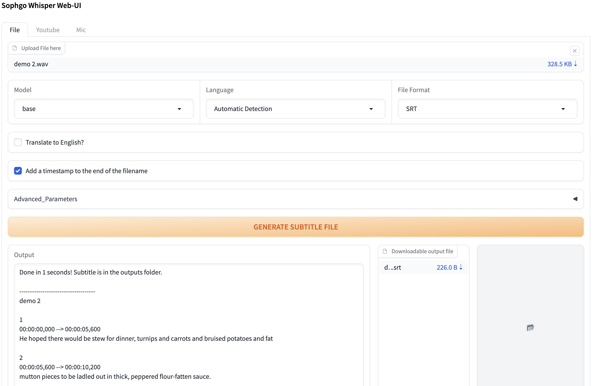

# Whisper-WebUI For Sophgo Whisper
A Gradio-based browser interface for [Whisper](https://github.com/openai/whisper). You can use it as an Easy Subtitle Generator!

Powered by [Whisper-WebUI](https://github.com/jhj0517/Whisper-WebUI/tree/master)



## Notebook

# Feature
- Generate subtitles from various sources, including :
  - Files
  - Youtube
  - Microphone
- Currently supported subtitle formats :
  - SRT
  - WebVTT
  - txt ( only text file without timeline )
- Speech to Text Translation
  - From other languages to English. ( This is Whisper's end-to-end speech-to-text translation feature )


# Installation and Running
## Prerequisite
To run this WebUI, you need to have `git`, `python` version 3.8 ~ 3.10, `Sophon driver`  and `FFmpeg`.

Please follow the links below to install the necessary software:
- Driver : [https://doc.sophgo.com/sdk-docs/v23.09.01-lts/docs_latest_release/docs/SophonSDK_doc/zh/html/sdk_intro/4_install.html#id8](https://doc.sophgo.com/sdk-docs/v23.09.01-lts/docs_latest_release/docs/SophonSDK_doc/zh/html/sdk_intro/4_install.html#id8)
- git : [https://git-scm.com/downloads](https://git-scm.com/downloads)
- python : [https://www.python.org/downloads/](https://www.python.org/downloads/) **( If your python version is too new, torch will not install properly.)**
- FFmpeg :  [https://doc.sophgo.com/sdk-docs/v23.09.01-lts/docs_latest_release/docs/SophonSDK_doc/zh/html/sdk_intro/4_install.html#id9](https://doc.sophgo.com/sdk-docs/v23.09.01-lts/docs_latest_release/docs/SophonSDK_doc/zh/html/sdk_intro/4_install.html#id9)
- Sail : [Sail_Install_Guide](./docs/Sail_Install_Guide.md)

After installing FFmpeg, **make sure to add the `FFmpeg/bin` folder to your system PATH!**
```bash
export PATH=$PATH:/opt/sophon/sophon-ffmpeg-latest/bin
```

## Automatic Installation
If you have satisfied the prerequisites listed above, you are now ready to start Whisper-WebUI.

1. Run `install.sh`
2. Run `start-webui.sh`
3. Open your web browser and go to `http://localhost:7860`

( If you're running another Web-UI, it will be hosted on a different port , such as `localhost:7861`, `localhost:7862`, and so on )


